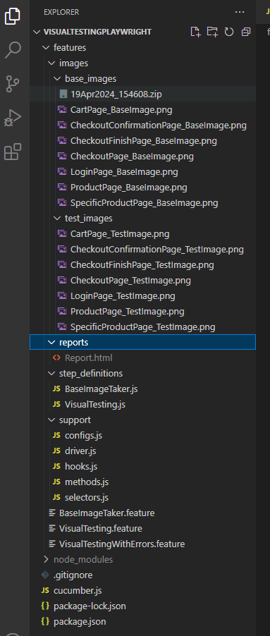

# Visual Testing using CucumberJS, Playwright, JavaScript and PixelMatch

This repo has the code which implements Visual Testing using Playwright for the website, https://www.saucedemo.com/. It uses BDD (Cucumber.js) and JavaScript. 

Visual testing involves verifying whether a webpage is rendered correctly. It’s different from Functional testing as Visual testing ensures that the look of a webpage is not compromised. For example, we have a button in a webpage, if the icon for the button is not loaded functional tests will not catch it as the button works properly, but visual tests will catch it. 
Visual tests compare the current webpage with an image of an existing image, called a base image, to compare and if there are any differences in the images, it flags it.

In this repo, we have 3 tests : 

* BaseImageTaker.feature
* VisualTesting.feature
* VisualTestingWithErrors.feature

The tests are done for the below pages in https://www.saucedemo.com/

* Login Page
* Product Page
* Specific Product Page
* Cart Page
* Checkout Page
* Checkout Confirmation Page
* Checkout Finish Page

The BaseImageTaker.feature takes the Base images of the above pages and should only be run when there's any intended change in the above pages, as it updates the images that we use to compare against.

The VisualTesting.feature has the regular scenarios which will check all the above pages and compare it with the base images. It uses the normal login.

The VisualTestingWithErrors.feature has the same scenarios as VisualTesting.feature which will check all the above pages and compare it with the base images. It uses the visual_user login, its a login provided by Sauce Demo, which has some UI issues. Using this user login we can validate the accuracy of our tests.

Project setup guide is available in the PDF doc [VisualTestingPlaywright.pdf](VisualTestingPlaywright.pdf)

### **Folder Structure**

